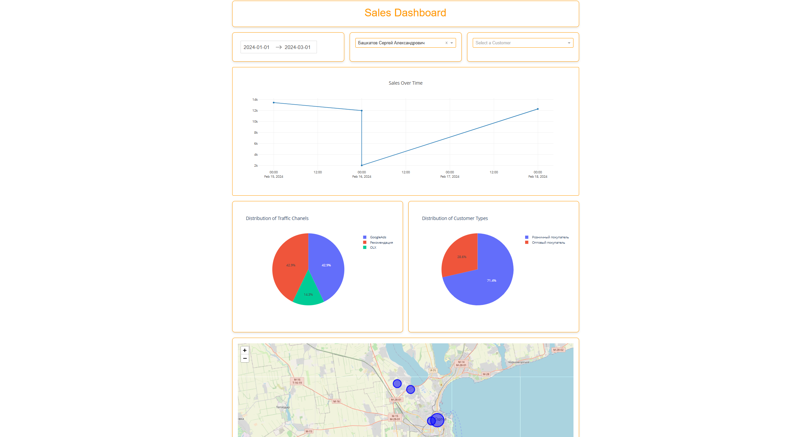

# 📊 Sales Analytics Dashboard Web App

This project is an interactive web-based sales analytics dashboard built using **Dash** (Plotly), **Pandas**, **PostgreSQL**, and **Leaflet** for map visualizations.

## 🧱 Project Overview

The dashboard allows dynamic exploration of sales data by date, manager, and customer. It includes real-time visualizations, interactive maps, and key performance indicators.

## 🚀 Features

- 📅 Date range filter
- 🧑 Manager & Customer dropdown filters
- 📈 Line chart: Sales Over Time
- 🥧 Pie charts:
  - Distribution of Traffic Channels
  - Distribution of Customer Types
- 🗺 Customer Location Map (interactive markers by order count)
- 📦 KPI Cards:
  - Total Sales
  - Total Revenue
  - Average Order Value

## 🧠 Skills Demonstrated

- **Dash (Plotly + Dash Bootstrap Components)**
  - Built responsive layout using Dash and styled with Bootstrap
  - Created callbacks for dynamic interactivity

- **SQL + PostgreSQL**
  - Queried multiple related tables (Sales, Managers, Customers, Marketing)
  - Joined and aggregated data with filters by date, manager, customer

- **Pandas**
  - Processed query results and transformed data for visualizations

- **Geospatial Visualization (dash-leaflet)**
  - Displayed interactive map with scaled circle markers
  - Dynamically centered the map based on customer locations

## 📷 Dashboard Preview

